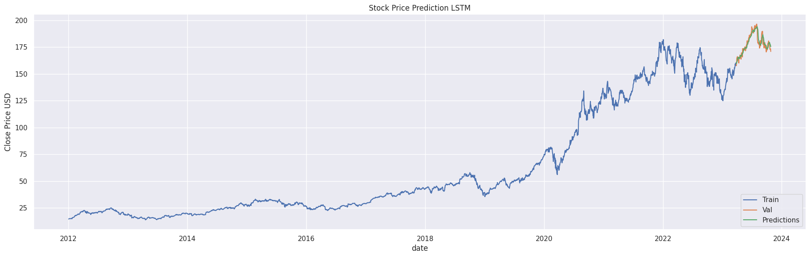

# Stock Market Data Analysis and Prediction

**Project Description:**

This project focuses on exploring and analyzing data from the stock market, with a particular emphasis on technology stocks like Apple, Amazon, Google, and Microsoft. We will use Python and various libraries, including yfinance, Seaborn, Matplotlib, and TensorFlow, to conduct data analysis and make stock price predictions using Long Short Term Memory (LSTM) models.

**Key Questions to Answer:**

1. **Change in Stock Price Over Time:** We'll examine how the stock prices of the selected companies have changed over time.

2. **Daily Stock Return:** We'll calculate the average daily returns for these stocks.

3. **Moving Averages:** We'll determine the moving averages for these stocks to identify trends.

4. **Correlation Between Stocks:** We'll analyze how correlated the stock prices of these technology companies are.

5. **Risk Analysis:** We'll calculate and visualize the Value at Risk (VaR) to understand the potential risk of investing in a specific stock.

6. **Stock Price Prediction:** We will predict the closing stock price of Apple Inc. using LSTM.

**Data Collection:**

We will use the `yfinance` library to collect historical stock data for the selected technology stocks. The code for data collection can be found in the `LSTM.ipynb` notebook.

```python
dataset.info()
'''
<class 'pandas.core.frame.DataFrame'>
DatetimeIndex: 1008 entries, 2022-10-25 to 2023-10-25
Data columns (total 7 columns):
 #   Column        Non-Null Count  Dtype  
---  ------        --------------  -----  
 0   Open          1008 non-null   float64
 1   High          1008 non-null   float64
 2   Low           1008 non-null   float64
 3   Close         1008 non-null   float64
 4   Adj Close     1008 non-null   float64
 5   Volume        1008 non-null   int64  
 6   company_name  1008 non-null   object 
dtypes: float64(5), int64(1), object(1)
memory usage: 63.0+ KB
'''
```

```python
dataset.describe()
'''
        Open        High           Low            Close       Adj Close   Volume
count    1008.000000    1008.000000    1008.000000    1008.000000    1008.000000    1.008000e+03
mean    169.622833    171.583433    167.813837    169.747240    169.404270    4.633779e+07
std        77.353115    77.987355    76.737772    77.370338    77.060230    2.664341e+07
min        82.800003    83.480003    81.430000    81.820000    81.820000    8.567800e+06
25%     106.575001    108.236250    105.309999    106.740000    106.740000    2.453585e+07
50%        138.570000    139.739998    136.940002    138.395004    138.264999    4.274050e+07
75%        201.567505    203.774998    199.817497    200.899998    200.188801    5.999932e+07
max        361.750000    366.779999    352.440002    359.489990    358.730469    2.231334e+08

'''
```

**Data Analysis and Visualization:**

In the `LSTM.ipynb` notebook, we will visualize and analyze various aspects of the stock data, including historical trends, daily returns, moving averages, and correlation between stocks.

**Risk Analysis:**

To assess investment risk, we will calculate and visualize Value at Risk (VaR) in the `LSTM.ipynb` notebook.


**Stock Price Prediction:**

We will implement a Long Short Term Memory (LSTM) model to predict the closing stock price of Apple Inc. using historical data. The code and details of the prediction can be found in the `LSTM.ipynb` notebook.



**Dependencies:**

- Python 3.7+
- Jupyter Notebook
- NumPy
- Pandas
- Matplotlib
- Seaborn
- yfinance
- TensorFlow

**Reference**

[Kaggle]([&#x1F4CA;Stock Market Analysis &#x1F4C8; &#x2B; Prediction using LSTM | Kaggle](https://www.kaggle.com/code/faressayah/stock-market-analysis-prediction-using-lstm#Data-Project---Stock-Market-Analysis))